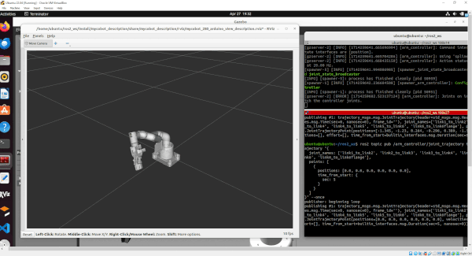
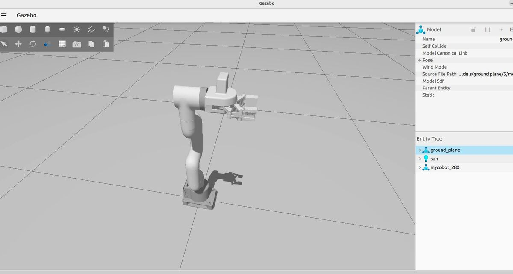

# Robotic Arm — ROS2 Control + Gazebo (roboArm_1)

**roboArm** is a ROS 2 project that demonstrates how to simulate and control a myCobot-style robotic arm in Gazebo using `ros2_control` (controller_manager + ros2_controllers) and `ros_gz_sim` / Gazebo.
This repo contains the extracted XACRO/URDF, controller YAML, launch file, example trajectory publishers (Python) and packages them into a reproducible workspace.

---

## 🧠 System Overview

```text
   ┌─────────────────────────────┐
   │        ros_gz_sim / Gazebo  │
   │  • 3D physics & robot model │
   │  • ros_gz_sim plugins       │
   └──────────────┬──────────────┘
                  │ (spawn via launch)
                  ▼
   ┌─────────────────────────────┐
   │       ros2_control          │
   │  • controller_manager       │
   │  • joint_trajectory_ctrls   │
   └──────────────┬──────────────┘
                  │ (topics / actions)
                  ▼
   ┌─────────────────────────────┐
   │   Example nodes / clients   │
   │  • example_joint_trajectory │
   │  • publishers (py / cpp)    │
   └─────────────────────────────┘
```

---

## 🖼️ Project Photos / Diagrams

Place simulation screenshots or robot photos in `media/`:

|         Video         |            roboArm Model           |
| :---------------------------------: | :-------------------------------------: |
|  |  |

---

## 🎥 System Architecture


---

## ⚙️ Installation Guide

### Prerequisites

* Ubuntu compatible with your ROS 2 distro (recommended: **Humble** or **Iron** — set `ROS_DISTRO` accordingly).
* ROS 2 (desktop) installed and sourced.
* `colcon` build tool.

Install required ROS 2 packages (example for Humble / Iron — adjust `ROS_DISTRO`):

```bash
export ROS_DISTRO=humble    # or iron
sudo apt update
sudo apt install -y \
  ros-${ROS_DISTRO}-ros2-control \
  ros-${ROS_DISTRO}-ros2-controllers \
  ros-${ROS_DISTRO}-gazebo-ros2-control \
  ros-${ROS_DISTRO}-robot-state-publisher \
  ros-${ROS_DISTRO}-rviz2 \
  ros-${ROS_DISTRO}-ros-gz-sim \
  python3-colcon-common-extensions
```

Python deps for examples (optional):

```bash
python3 -m venv env
source env/bin/activate
pip install rclpy
# other deps if needed for helper scripts
```

---

## 🧱 Repo Structure

```
robotic-arm/
├── README.md                      
├── LICENSE                         
├── .gitignore
├── launch/
├── scripts/
└── media/
```

---

## 🚀 Build & Run — Copy-paste ready

### 1. Build workspace

From repo root:

```bash
cd ros2_ws
colcon build --packages-select roboArm_ros2
source install/setup.bash
```

### 2. Launch simulation (Gazebo + controllers)

```bash
# source the overlay then launch
source ros2_ws/install/setup.bash
ros2 launch roboArm_ros2 roboArm_1_bringup_ros2_gazebo.launch.py
```

The launch will:

* start `ros_gz_sim` and spawn the myCobot URDF,
* start `robot_state_publisher` (if enabled),
* load `joint_state_broadcaster`, `arm_controller`, `grip_controller`,
* optionally start RViz if `use_rviz` is true in the launch.

### 3. Run example trajectory publisher (Python)

Open a new terminal, source overlay, and run:

```bash
source ros2_ws/install/setup.bash
python3 ros2_ws/src/roboArm_ros2/src/roboArm_1_joint_trajectory_publisher.py
```

This publishes joint trajectories to:

* `/arm_controller/joint_trajectory`
* `/grip_controller/joint_trajectory`

---

## 🔧 Important Files (what they do)

* `urdf/*.xacro` — robot description with `ros2_control` entries (joint interfaces, limits, mimic joints).
* `config/roboArm_controllers.yaml` — controller definitions (joint_trajectory_controller, joint_state_broadcaster, gripper controller).
* `launch/*.launch.py` — spawns robot in Gazebo, sets `GZ_SIM_RESOURCE_PATH`, registers event handlers to load controllers in order.
* `src/roboArm_1_joint_trajectory_publisher.py` — simple ROS 2 node that publishes a 4-step trajectory (arm + gripper).

---

## 🧑‍💻 Development & Contributions

Suggested workflow:

1. Fork → create a topic branch → open a PR with description & tested steps.
2. Keep URDF changes atomic and include screenshots.

---

## 📜 License

This project is released under the **MIT License**. Add `LICENSE` to repo root.

---

## 👩‍🔬 Maintainers

**Project Lead:** Shaneshraje Kadu\
**Affiliation:** IIT (BHU), Varanasi\
**Club:** Aero-Modelling Club

---

## 📬 Contact

📧 [shaneshraje@gmail.com](mailto:shaneshraje@gmail.com)
GitHub: [@ShaneshrajeK](https://github.com/ShaneshrajeK)

---

> 🛠 *“Simulate, control, iterate — build reliable robotic arms one URDF at a time.”*

